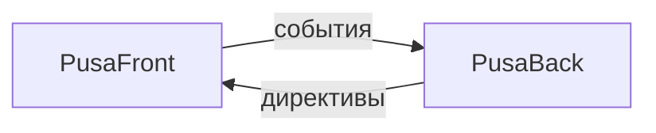
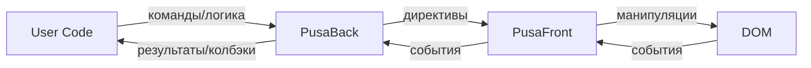

# Pusa 2.0

Pusa 2.0 — server-driven declarative UI

```mermaid
graph LR
    PF[PusaFront]
    PB[PusaBack]

    PB -- "директивы" --> PF
    PF -- "события" --> PB
```

```mermaid
graph LR
    UC[User Code]
    PB[PusaBack]
    PF[PusaFront]
    DOM[DOM]

    UC -- "команды/логика" --> PB
    PB -- "директивы" --> PF
    PF -- "манипуляции" --> DOM
    DOM -- "события" --> PF
    PF -- "события" --> PB
    PB -- "результаты/колбэки" --> UC
```
